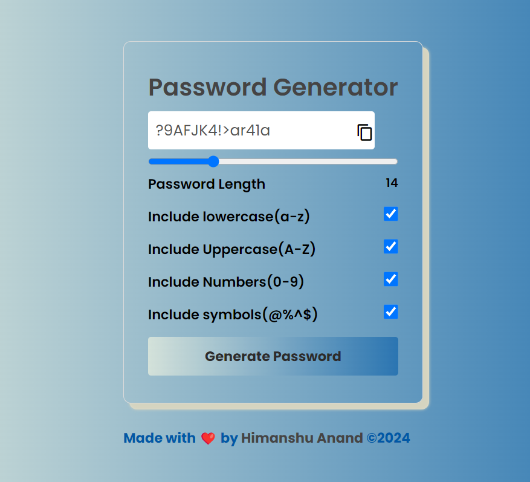

# 🛠️ Password Generator 🎨

Generate strong and secure passwords with ease! This project provides a user-friendly interface to create passwords tailored to your preferences. 

## 🚀 Live Demo
Experience it in action [here](https://passgenbyanshu.netlify.app/)!

## ✨ Features
- Customize password length
- Include lowercase and uppercase letters
- Include numbers and symbols
- Copy generated passwords to clipboard
- Intuitive and responsive design

## 📸 Screenshots

## 📝 Usage
1. Set your desired password length using the slider.
2. Choose the character types to include.
3. Click the "Generate Password" button.
4. Copy the generated password with a single click.

## 💻 Technologies Used
- HTML
- CSS
- JavaScript

## 🌟 How to Contribute
Contributions are welcome! Feel free to submit bug fixes, feature enhancements, or suggestions through [pull requests](CONTRIBUTING.md).

## 📧 Contact
For any inquiries or feedback, please contact [Himanshu Anand](mailto:anshuhim001@gmail.com).

